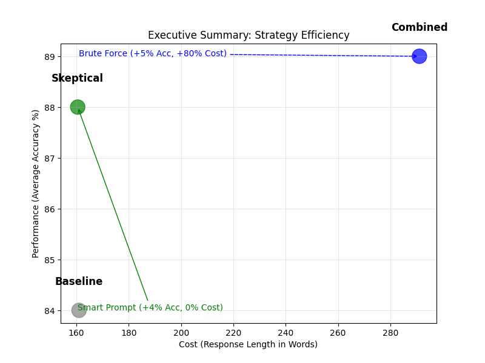

# Fixing Lazy LLMs

## Overview
This project investigates methods to mitigate "laziness" in LLMs—the tendency to provide low-effort, short, or heuristic-based answers. We implemented and tested a "Harsh Critic" persona combined with "Budget Control" (forcing reasoning steps) on GSM8K and TruthfulQA.

## Key Findings

-   **No "One Prompt to Rule Them All":** Different tasks require different strategies.
-   **Reasoning (Math/Logic):** Use **"Harsh Critic + Budget Control"** (90% accuracy). The combination of motivation (Critic) and structure (Step-by-step) is essential.
-   **Factuality (Truthfulness):** Use **"Skeptical Scientist"** (90% accuracy). A persona of rigorous verification works best. Forcing "step-by-step" reasoning actually *hurt* performance here.
-   **Laziness Cured:** All intervention strategies significantly increased response depth and quality over the Baseline.

## Best Practices
| Task Type | Recommended Strategy | Why? |
|-----------|----------------------|------|
| **Math / Complex Logic** | **Harsh Critic + Budget** | Needs structure (Budget) to avoid skipping steps, and motivation (Critic) to be rigorous. |
| **Fact Checking / Debunking** | **Skeptical Scientist** | Needs skepticism to detect misconceptions. "Politeness" prevents performance degradation. |
| **Creative Writing** | *Likely High Standards* | (Extrapolated) Polite high standards likely aid focus without stifling creativity. |

## File Structure
-   `src/experiment_runner.py`: Main script to run experiments.
-   `src/analyze_results.py`: Script to score and visualize results.
-   `results/`: Contains raw JSONL data and generated plots/metrics.
-   `REPORT.md`: Detailed research report.

## Reproduction
1.  Install dependencies: `uv add openai pandas datasets tqdm scikit-learn numpy matplotlib seaborn`
2.  Run experiment: `python src/experiment_runner.py`
3.  Analyze: `python src/analyze_results.py`
