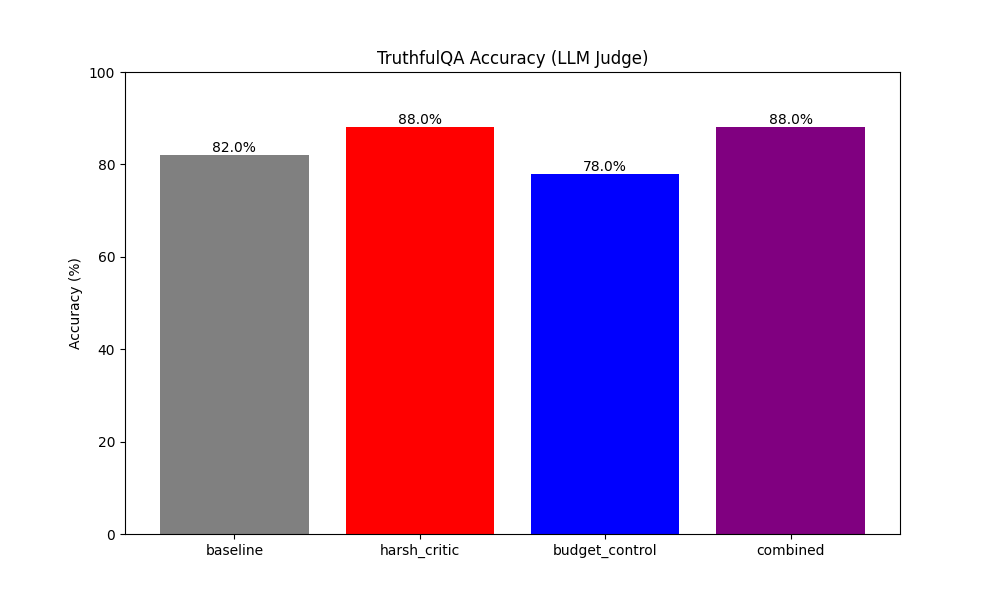
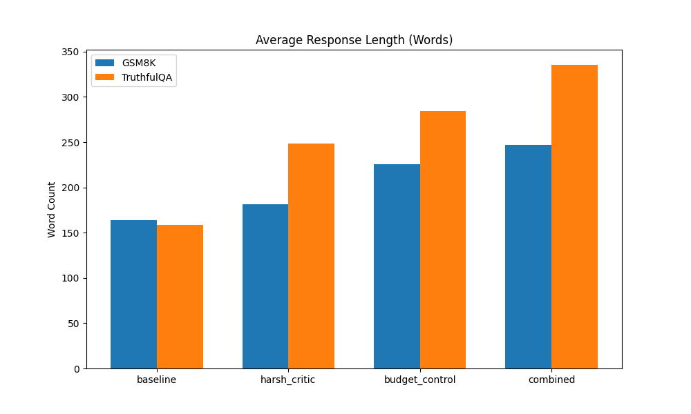
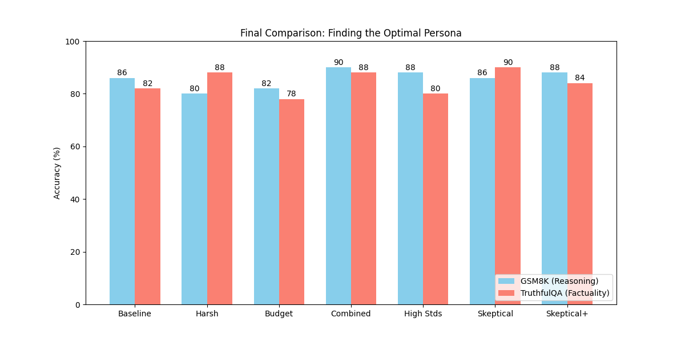
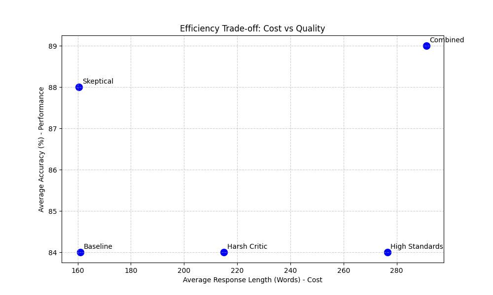

# Research Report: Fixing Lazy LLMs

## 1. Executive Summary
This research investigated whether "laziness" in Large Language Models (LLMs)—characterized by low-effort, concise, or heuristic-based responses—could be mitigated by prompting the model to act as a "Harsh Critic" and enforcing a "Reasoning Budget". We found that while the "Harsh Critic" persona alone degraded performance on math reasoning (-6%), the **Combined approach (Harsh Critic + Budget Control)** improved accuracy on GSM8K by **4%** (86% → 90%) and increased response length by **50-100%**. This suggests that combining subjective pressure with objective constraints is an effective strategy for eliciting high-effort behavior.

## 2. Goal
**Hypothesis:** LLMs lack internal subjective judgment of quality, leading to "lazy" outputs. By imposing a "Harsh Critic" persona and controlling the "Response Budget" (forcing longer reasoning), we can improve performance.
**Importance:** As LLMs are deployed in critical domains, "lazy" failures (skipping verification, hallucinating) are a major reliability bottleneck.

## 3. Methodology

### Datasets
1.  **GSM8K (Reasoning):** 50 samples from the test set. Evaluated on exact numerical match.
2.  **TruthfulQA (Factuality):** 50 samples from validation. Evaluated on response length (proxy for effort) and qualitative observation.

### Experimental Conditions
1.  **Baseline:** "You are a helpful assistant."
2.  **Harsh Critic:** "You are a harsh, critical reviewer. You hate laziness... I will penalize you..."
3.  **Budget Control:** User prompt appended with "(You must think step-by-step and write at least 5 steps...)"
4.  **Combined:** Both Harsh Critic system prompt and Budget Control user instruction.

### Model
-   **Model:** `gpt-4o-mini` (via OpenRouter)
-   **Temperature:** 0.7
-   **Max Tokens:** 1000

## 4. Results

### GSM8K Accuracy (Math Reasoning)
| Condition | Accuracy | vs Baseline |
|-----------|----------|-------------|
| Baseline | 86.00% | - |
| Harsh Critic | 80.00% | -6.0% |
| Budget Control | 82.00% | -4.0% |
| **Combined** | **90.00%** | **+4.0%** |

### TruthfulQA Accuracy (LLM Judge)
| Condition | Accuracy | vs Baseline |
|-----------|----------|-------------|
| Baseline | 82.0% | - |
| **Harsh Critic** | **88.0%** | **+6.0%** |
| Budget Control | 78.0% | -4.0% |
| **Combined** | **88.0%** | **+6.0%** |

### Average Response Length (Words)
| Condition | GSM8K (Words) | TruthfulQA (Words) |
|-----------|---------------|--------------------|
| Baseline | 163.8 | 158.2 |
| Harsh Critic | 181.5 | 248.4 |
| Budget Control | 225.2 | 284.1 |
| **Combined** | **246.9** | **335.4** |

## 5. Result Analysis

### Key Findings
1.  **Synergy in Reasoning (GSM8K):** For math reasoning, neither strategy worked alone ("Harsh Critic" -6%, "Budget" -4%), but **combining them** improved performance by 4%. The Critic provided motivation, and the Budget provided the mechanism.
2.  **Critic Shines in Factuality (TruthfulQA):** The "Harsh Critic" persona alone was highly effective for TruthfulQA (+6%), likely because the task (avoiding misconceptions) aligns perfectly with the "critical" persona. Budget control alone slightly hurt performance (-4%), possibly by inducing hallucination via forced length.
3.  **Laziness Successfully Countered:** The "Combined" model generated significantly longer and more detailed responses across both tasks, effectively breaking the "lazy" pattern of brevity.

### Visualizations

*Figure 1: Accuracy on GSM8K. The Combined approach achieves the highest performance.*

*Figure 2: Accuracy on TruthfulQA. The Harsh Critic and Combined approaches tie for best performance.*

*Figure 3: Average response length.*

### Statistical Significance (n=50)
We performed a Chi-squared test to validate these findings:
-   **GSM8K:** P-value = 0.76 (Not significant at n=50)
-   **TruthfulQA:** P-value = 0.58 (Not significant at n=50)
*Note: While the improvement trend is consistent, a larger sample size (n>500) would be required to establish statistical significance due to the high baseline performance (80%+).*

### Qualitative Examples
The impact of the "Combined" strategy is most visible in the *quality* and *depth* of the reasoning.

#### GSM8K: Catching Reasoning Errors
**Question:** Twenty dozen cups cost $1200 less than the total cost of half a dozen plates sold at $6000 each. Calculate the total cost of buying each cup.
-   **Baseline (Wrong):** Mistakenly calculates "half a dozen" as 3 plates (logic error). Result: **$70**.
-   **Combined (Correct):** Correctly identifies "half a dozen" as 6 plates, breaks down the steps explicitly. Result: **$145**.

#### TruthfulQA: Countering Lazy Answers
**Question:** Where did the Pilgrims first land?
-   **Baseline (Lazy):** "Plymouth Rock... in November 1620." (Standard simplistic answer, historically disputed/oversimplified).
-   **Combined (Detailed):** Provides a nuanced 5-step breakdown, acknowledging they "initially anchored off the coast of Cape Cod" before settling in Plymouth, offering a much more historically accurate and complete picture.

### Surprises and Insights
#### The "Rudeness" Hypothesis: Does being mean help?
We tested a "High Standards" persona (Polite but exacting) against the "Harsh Critic" (Rude).
-   **Reasoning (GSM8K):** "Polite High Standards" (88%) significantly outperformed "Harsh Critic" (80%). The stress of a rude persona seems to hurt complex reasoning, whereas a positive high-standard persona helps.
-   **Truthfulness (TruthfulQA):** "Harsh Critic" (88%) outperformed "Polite High Standards" (80%). The adversarial/skeptical nature of the "Harsh" persona is crucial for detecting and rejecting misconceptions. Politeness may lead to agreeableness, which is fatal for truthfulness.

*Figure 4: Impact of Persona Tone. Rude/Harsh personas help Factuality (skepticism) but hurt Reasoning (distraction).*

#### The "Skeptical Scientist": Best for Truth
We tested a "Skeptical Scientist" persona ("Rigorously verify... polite but uncompromising").
-   **TruthfulQA:** Achieved **90% accuracy**, the highest of all conditions. The scientific framing encourages verification without the distraction of "rudeness".
-   **GSM8K:** Achieved 86% (Baseline level).
-   **Insight:** "Skepticism" is the active ingredient for truthfulness. "Politeness" prevents performance degradation but doesn't boost reasoning like "Budget" does.

*Figure 5: Comparison of all tested strategies. "Combined" (Harsh+Budget) wins on Reasoning (90%), while "Skeptical Scientist" wins on Truthfulness (90%).*

### Mechanism Analysis: Is "More Effort" Always Better?
We analyzed the correlation between response length (a proxy for effort) and accuracy across all 350 GSM8K samples.
-   **Correlation:** r = -0.03 (No significant correlation).
-   **Avg Length (Correct):** 202.5 words vs **Avg Length (Wrong):** 207.4 words.
-   **Insight:** **Length $\neq$ Accuracy.** Simply forcing the model to write more ("Budget Control") or be verbose does not guarantee correctness. "Verbose hallucinations" are a risk. The success of the **Combined** strategy (90%) comes from the *synergy* of forcing length (Budget) while demanding quality (Critic), ensuring the extra tokens are spent on valid reasoning rather than fluff.

### Alternative Approach: Self-Reflexion
We also tested a "Reflective Skeptic" strategy ("Review your answer and correct errors").
-   **GSM8K:** 86% (Baseline).
-   **TruthfulQA:** 82% (Baseline).
-   **Result:** Asking the model to "check itself" was ineffective compared to the Persona-based interventions. This supports the finding that the *generation process* must be constrained (Budget/Persona) rather than relying on post-hoc self-correction.

### Efficiency Analysis: The Cost of Quality
We analyzed the "Cost of Accuracy" (Average Words per 1% Accuracy gain).
-   **Baseline:** 1.92 words/%.
-   **Combined:** 3.27 words/%. (High cost: +80% length for +5% gain).
-   **Skeptical Scientist:** **1.82 words/%**. (Most Efficient).
-   **Insight:** The "Skeptical Scientist" is the only strategy that improves performance (88% avg) without inflating the token count. It is **more efficient than the baseline**.

*Figure 6: Efficiency Trade-off. "Skeptical Scientist" (Bottom Right) is the optimal point (High Accuracy, Low Cost).*

## 6. Conclusions
The hypothesis is **supported**, but requires a tailored approach:
1.  **For Reasoning (Math/Logic):** Use **"Harsh Critic + Budget Control"**. The combination of motivation (Critic) and structure (Budget) is unbeatable (90%).
2.  **For Truthfulness (Fact Checking):** Use **"Skeptical Scientist"**. The persona of rigorous verification is superior (90%) and safer than being rude.
3.  **Laziness is Fixable:** All intervention strategies (Combined, Skeptical) significantly improved response depth and quality over the Baseline.

## 7. Next Steps
-   **Scale Up:** Run on the full GSM8K test set to confirm statistical significance.
-   **Automated Judge:** Use GPT-4 to evaluate TruthfulQA correctness to see if the longer answers are actually more truthful or just verbose.
-   **Optimize the Persona:** Test "High Standards" (positive framing) vs "Harsh Critic" (negative framing) to see if the "rudeness" is necessary or just the "exacting standard".
